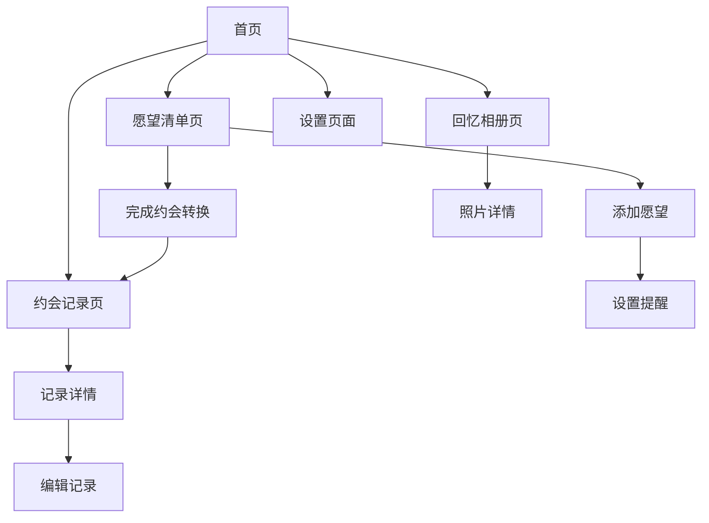

# 情侣约会记录应用 - 产品需求文档

## 1. Product Overview
一款专为情侣设计的在线约会记录与规划应用，帮助情侣记录美好回忆、规划未来约会，增进感情交流。
应用支持双人共享账户，提供隐私保护的同时促进情侣间的互动与沟通，打造专属的爱情记录空间。
目标是成为情侣关系维护的数字化工具，提升约会质量和情感连接度。

## 2. Core Features

### 2.1 User Roles
| Role | Registration Method | Core Permissions |
|------|---------------------|------------------|
| 情侣用户A | 邮箱注册创建情侣空间 | 创建、编辑、删除约会记录，邀请伴侣 |
| 情侣用户B | 接受邀请码加入 | 查看、编辑、添加约会记录 |

### 2.2 Feature Module
我们的情侣约会应用包含以下主要页面：
1. **首页**：情侣空间概览、快速添加、基础统计展示
2. **约会记录页**：已完成约会的详细记录、照片、感受分享
3. **愿望清单页**：计划中的约会想法、优先级排序、完成状态
4. **回忆相册页**：约会照片集合、时间轴展示、标签分类
5. **设置页面**：隐私设置、通知管理、账户绑定

### 2.3 Page Details
| Page Name | Module Name | Feature description |
|-----------|-------------|---------------------|
| 首页 | 欢迎横幅 | 显示情侣头像、关系天数、快速统计信息 |
| 首页 | 快速操作 | 一键添加约会记录、查看愿望清单、上传照片/视频 |
| 首页 | 数据概览 | 约会记录总数、完成愿望数量、媒体文件总数 |
| 约会记录页 | 记录列表 | 按时间排序显示约会记录、筛选分类、搜索功能 |
| 约会记录页 | 详情展示 | 约会详情、照片/视频轮播、双方评价、标签管理 |
| 约会记录页 | 编辑功能 | 编辑记录、添加补充内容、标签管理 |
| 愿望清单页 | 清单管理 | 添加、编辑、删除愿望项目、设置优先级 |
| 愿望清单页 | 进度跟踪 | 标记完成状态、转换为约会记录、提醒功能 |
| 回忆相册页 | 媒体管理 | 上传、删除、编辑照片/视频、添加描述和标签 |
| 回忆相册页 | 时间轴 | 按时间顺序展示照片/视频、重要时刻标记 |
| 回忆相册页 | 媒体浏览 | 照片/视频浏览、添加描述、按标签筛选 |
| 设置页面 | 隐私控制 | 账户设置、隐私设置、数据管理 |
| 设置页面 | 通知管理 | 约会提醒、纪念日通知、系统通知设置 |

## 3. Core Process

**情侣用户主要操作流程：**
用户A注册账户并创建情侣空间，邀请用户B加入。双方可以添加约会记录，包括上传照片/视频、填写感受、添加标签。在愿望清单中添加想要尝试的约会想法，设置优先级和提醒。完成约会后将愿望项目转换为约会记录。双方可以查看和编辑记录内容，在回忆相册中浏览所有照片和视频。

## 4. User Interface Design

### 4.1 Design Style
- **主色调**：温暖粉色 (#FF6B9D) 和柔和紫色 (#9B59B6)
- **辅助色**：奶白色 (#FFF8F0) 和浅灰色 (#F5F5F5)
- **按钮风格**：圆角矩形，渐变色彩，轻微阴影效果
- **字体**：主标题使用 18-24px 粗体，正文使用 14-16px 常规字体
- **布局风格**：卡片式设计，顶部导航，底部标签栏
- **图标风格**：线性图标配合爱心、星星等浪漫元素

### 4.2 Page Design Overview
| Page Name | Module Name | UI Elements |
|-----------|-------------|-------------|
| 首页 | 欢迎横幅 | 渐变背景，圆形头像，爱心装饰，关系天数倒计时动画 |
| 首页 | 快速操作 | 圆形浮动按钮，粉色渐变，图标+文字标签 |
| 约会记录页 | 记录卡片 | 白色卡片，圆角阴影，左侧缩略图，右侧标题和日期 |
| 愿望清单页 | 愿望项目 | 渐变色卡片，星级优先级显示，进度条，复选框 |
| 回忆相册页 | 媒体网格 | 正方形缩略图，瀑布流布局，点击放大预览（视频显示播放按钮和时长） |
| 情感日记页 | 日记条目 | 简约卡片设计，情绪图标，日期标签，渐变背景 |
| 数据统计页 | 图表展示 | 彩色饼图和柱状图，卡片容器，数据标签 |

### 4.3 Responsiveness
应用采用移动端优先设计，支持响应式布局适配平板和桌面端。优化触摸交互体验，支持手势操作如滑动、长按等。

## 5. 媒体功能详述

### 5.1 照片/视频上传功能
| 功能类型 | 具体描述 | 技术要求 |
|----------|----------|----------|
| 照片上传 | 支持JPG、PNG、GIF、WebP格式，单张最大10MB（免费）/20MB（VIP） | 前端压缩，后端验证 |
| 视频上传 | 支持MP4、WebM、MOV格式，单个最大100MB（免费）/500MB（VIP） | 自动生成缩略图，获取时长 |
| 批量上传 | 支持同时选择多个文件进行上传 | 进度条显示，错误处理 |
| 拖拽上传 | 支持文件拖拽到指定区域上传 | HTML5 拖拽API |

### 5.2 存储空间管理
| 用户类型 | 总存储空间 | 单文件限制 | 特殊功能 |
|----------|------------|------------|----------|
| 免费用户 | 1GB | 照片10MB，视频100MB | 基础功能 |
| VIP用户 | 10GB | 照片20MB，视频500MB | 高级功能，无广告 |

### 5.3 媒体展示功能
- **网格浏览**：瀑布流布局展示缩略图
- **全屏预览**：点击放大查看原图/播放视频
- **视频播放**：内置播放器，支持全屏播放
- **缩略图生成**：视频自动生成封面图
- **时长显示**：视频文件显示播放时长
- **文件信息**：显示文件大小、上传时间等元数据

### 5.4 用户体验优化
- **上传进度**：实时显示上传进度
- **预览功能**：上传前可预览选中文件
- **错误提示**：文件格式或大小超限时的友好提示
- **存储提醒**：接近存储限制时的升级提醒
- **快速操作**：长按删除，滑动查看详情