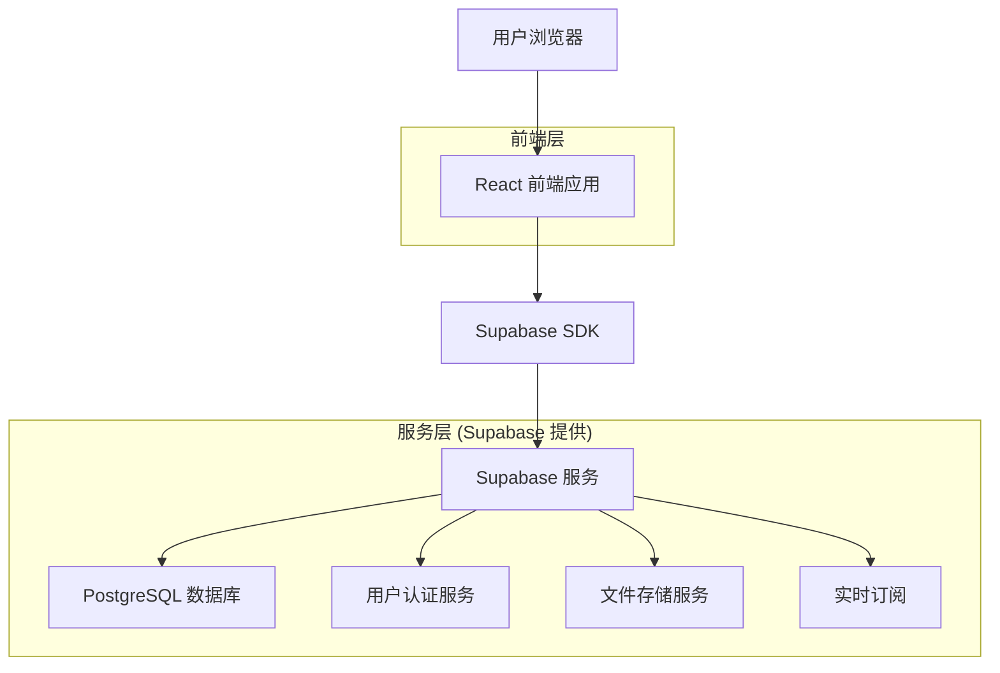
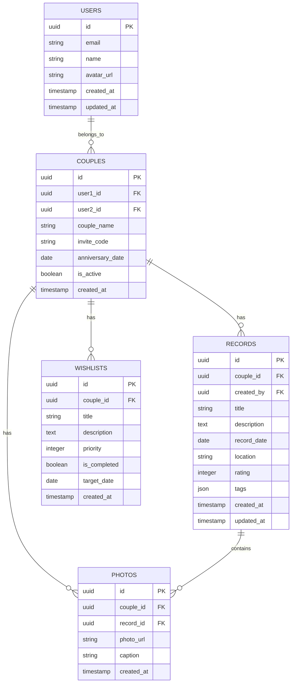

# 情侣约会记录应用 - 技术架构文档

## 1. Architecture Design



## 2. Technology Description

* **前端**: React\@18 + TypeScript + Tailwind CSS\@3 + Vite

* **后端**: Supabase (提供数据库、认证、存储、实时功能)

* **状态管理**: Zustand

* **UI组件**: Headless UI + 自定义组件

* **图片处理**: React Image Gallery + Image Compression

* **图表**: Chart.js

* **日期处理**: Day.js

## 3. Route Definitions

| Route         | Purpose             |
| ------------- | ------------------- |
| /             | 首页，显示情侣空间概览和快速操作    |
| /auth         | 登录注册页面，支持邮箱注册和邀请码加入 |
| /records      | 约会记录列表页，展示所有约会记录    |
| /records/:id  | 约会记录详情页，显示具体约会信息    |
| /wishlist     | 愿望清单页，管理计划中的约会想法    |
| /gallery      | 回忆相册页，照片时间轴和管理      |
| /settings     | 设置页面，隐私控制和账户管理      |
| /invite/:code | 邀请页面，伴侣加入情侣空间       |

## 4. API Definitions

### 4.1 Core API

**用户认证相关**

```
POST /auth/signup
```

Request:

| Param Name | Param Type | isRequired | Description |
| ---------- | ---------- | ---------- | ----------- |
| email      | string     | true       | 用户邮箱地址      |
| password   | string     | true       | 用户密码        |
| name       | string     | true       | 用户昵称        |

Response:

| Param Name | Param Type | Description |
| ---------- | ---------- | ----------- |
| user       | object     | 用户信息对象      |
| session    | object     | 会话信息        |

**情侣空间管理**

```
POST /api/couples
```

Request:

| Param Name     | Param Type | isRequired | Description |
| -------------- | ---------- | ---------- | ----------- |
| partner\_email | string     | false      | 伴侣邮箱（可选）    |
| couple\_name   | string     | true       | 情侣空间名称      |

Response:

| Param Name   | Param Type | Description |
| ------------ | ---------- | ----------- |
| couple\_id   | string     | 情侣空间ID      |
| invite\_code | string     | 邀请码         |

**约会记录管理**

```
POST /api/records
```

Request:

| Param Name  | Param Type | isRequired | Description |
| ----------- | ---------- | ---------- | ----------- |
| title       | string     | true       | 约会标题        |
| date        | string     | true       | 约会日期        |
| location    | string     | false      | 约会地点        |
| description | string     | false      | 约会描述        |
| photos      | array      | false      | 照片URL数组     |
| tags        | array      | false      | 标签数组        |
| rating      | number     | false      | 评分(1-5)     |

Example:

```json
{
  "title": "海边日落晚餐",
  "date": "2024-01-15",
  "location": "三亚海棠湾",
  "description": "在海边看日落，享受浪漫晚餐",
  "photos": ["https://example.com/photo1.jpg"],
  "tags": ["浪漫", "海边", "晚餐"],
  "rating": 5
}
```

## 5. Data Model

### 5.1 Data Model Definition



### 5.2 Data Definition Language

**用户表 (users)**

```sql
-- 用户表由 Supabase Auth 自动管理，扩展用户信息
CREATE TABLE user_profiles (
  id UUID PRIMARY KEY REFERENCES auth.users(id) ON DELETE CASCADE,
  name VARCHAR(100) NOT NULL,
  avatar_url TEXT,
  created_at TIMESTAMP WITH TIME ZONE DEFAULT NOW(),
  updated_at TIMESTAMP WITH TIME ZONE DEFAULT NOW()
);

-- RLS 策略
ALTER TABLE user_profiles ENABLE ROW LEVEL SECURITY;
CREATE POLICY "用户只能查看和编辑自己的资料" ON user_profiles
  FOR ALL USING (auth.uid() = id);

-- 权限设置
GRANT ALL PRIVILEGES ON user_profiles TO authenticated;
```

**情侣空间表 (couples)**

```sql
CREATE TABLE couples (
  id UUID PRIMARY KEY DEFAULT gen_random_uuid(),
  user1_id UUID REFERENCES auth.users(id) ON DELETE CASCADE,
  user2_id UUID REFERENCES auth.users(id) ON DELETE CASCADE,
  couple_name VARCHAR(200) NOT NULL,
  invite_code VARCHAR(20) UNIQUE NOT NULL,
  anniversary_date DATE,
  is_active BOOLEAN DEFAULT true,
  created_at TIMESTAMP WITH TIME ZONE DEFAULT NOW()
);

-- 索引
CREATE INDEX idx_couples_user1 ON couples(user1_id);
CREATE INDEX idx_couples_user2 ON couples(user2_id);
CREATE INDEX idx_couples_invite_code ON couples(invite_code);

-- RLS 策略
ALTER TABLE couples ENABLE ROW LEVEL SECURITY;
CREATE POLICY "情侣成员可以访问" ON couples
  FOR ALL USING (auth.uid() = user1_id OR auth.uid() = user2_id);

GRANT ALL PRIVILEGES ON couples TO authenticated;
```

**约会记录表 (records)**

```sql
CREATE TABLE records (
  id UUID PRIMARY KEY DEFAULT gen_random_uuid(),
  couple_id UUID REFERENCES couples(id) ON DELETE CASCADE,
  created_by UUID REFERENCES auth.users(id) ON DELETE CASCADE,
  title VARCHAR(200) NOT NULL,
  description TEXT,
  record_date DATE NOT NULL,
  location VARCHAR(300),
  rating INTEGER CHECK (rating >= 1 AND rating <= 5),
  tags JSONB DEFAULT '[]',
  created_at TIMESTAMP WITH TIME ZONE DEFAULT NOW(),
  updated_at TIMESTAMP WITH TIME ZONE DEFAULT NOW()
);

-- 索引
CREATE INDEX idx_records_couple_id ON records(couple_id);
CREATE INDEX idx_records_date ON records(record_date DESC);
CREATE INDEX idx_records_tags ON records USING GIN(tags);

-- RLS 策略
ALTER TABLE records ENABLE ROW LEVEL SECURITY;
CREATE POLICY "情侣成员可以访问记录" ON records
  FOR ALL USING (
    couple_id IN (
      SELECT id FROM couples 
      WHERE user1_id = auth.uid() OR user2_id = auth.uid()
    )
  );

GRANT ALL PRIVILEGES ON records TO authenticated;
```

**愿望清单表 (wishlists)**

```sql
CREATE TABLE wishlists (
  id UUID PRIMARY KEY DEFAULT gen_random_uuid(),
  couple_id UUID REFERENCES couples(id) ON DELETE CASCADE,
  title VARCHAR(200) NOT NULL,
  description TEXT,
  priority INTEGER DEFAULT 1 CHECK (priority >= 1 AND priority <= 5),
  is_completed BOOLEAN DEFAULT false,
  target_date DATE,
  created_at TIMESTAMP WITH TIME ZONE DEFAULT NOW()
);

-- 索引
CREATE INDEX idx_wishlists_couple_id ON wishlists(couple_id);
CREATE INDEX idx_wishlists_priority ON wishlists(priority DESC);

-- RLS 策略
ALTER TABLE wishlists ENABLE ROW LEVEL SECURITY;
CREATE POLICY "情侣成员可以访问愿望清单" ON wishlists
  FOR ALL USING (
    couple_id IN (
      SELECT id FROM couples 
      WHERE user1_id = auth.uid() OR user2_id = auth.uid()
    )
  );

GRANT ALL PRIVILEGES ON wishlists TO authenticated;
```

**照片表 (photos)**

```sql
CREATE TABLE photos (
  id UUID PRIMARY KEY DEFAULT gen_random_uuid(),
  couple_id UUID REFERENCES couples(id) ON DELETE CASCADE,
  record_id UUID REFERENCES records(id) ON DELETE CASCADE,
  photo_url TEXT NOT NULL,
  caption TEXT,
  created_at TIMESTAMP WITH TIME ZONE DEFAULT NOW()
);

-- 索引
CREATE INDEX idx_photos_couple_id ON photos(couple_id);
CREATE INDEX idx_photos_record_id ON photos(record_id);
CREATE INDEX idx_photos_created_at ON photos(created_at DESC);

-- RLS 策略
ALTER TABLE photos ENABLE ROW LEVEL SECURITY;
CREATE POLICY "情侣成员可以访问照片" ON photos
  FOR ALL USING (
    couple_id IN (
      SELECT id FROM couples 
      WHERE user1_id = auth.uid() OR user2_id = auth.uid()
    )
  );

GRANT ALL PRIVILEGES ON photos TO authenticated;
```

**初始化数据**

```sql
-- 创建邀请码生成函数
CREATE OR REPLACE FUNCTION generate_invite_code()
RETURNS TEXT AS $$
BEGIN
  RETURN upper(substring(md5(random()::text) from 1 for 8));
END;
$$ LANGUAGE plpgsql;

-- 创建触发器自动生成邀请码
CREATE OR REPLACE FUNCTION set_invite_code()
RETURNS TRIGGER AS $$
BEGIN
  IF NEW.invite_code IS NULL THEN
    NEW.invite_code := generate_invite_code();
  END IF;
  RETURN NEW;
END;
$$ LANGUAGE plpgsql;

CREATE TRIGGER trigger_set_invite_code
  BEFORE INSERT ON couples
  FOR EACH ROW
  EXECUTE FUNCTION set_invite_code();
```

